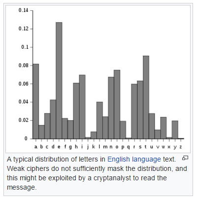
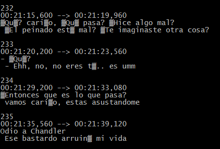
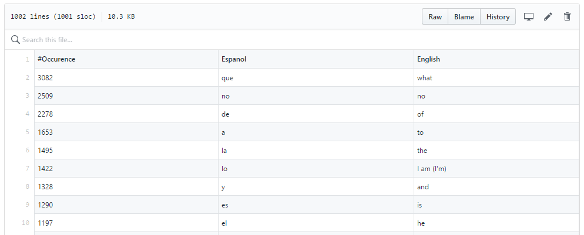

# Learn a New Language Using Data Science

If we ever think about [frequency analysis](https://en.wikipedia.org/wiki/Frequency_analysis), it is usually in the context of cryptography, in which it is used to break classical ciphers. In written language, patterns regularly appear, notably in the building blocks of words. Or saying it another way, the repition of certain letters of the alphabet.



As an aside, you may notice from the graph that you could derive the fanciful phrase [ETAOIN SHRDLU](https://en.wikipedia.org/wiki/Etaoin_shrdlu), which illustrates the 12 most frequent letters in English writing.

We may also apply the distribution of occurence to other forms of language study, which leads us to the premise for this article and related project. Using the concepts from [Learning languages very quickly — with the help of some very basic Data Science](https://hackernoon.com/learning-languages-very-quickly-with-the-help-of-some-very-basic-data-science-cdbf95288333), by [Tomi Mester](https://twitter.com/data36_com) we may be able to learn Spanish.

The idea is to use subtitles from movies or shows with which you are familiar. We leverage the subtitles to produce candidate lists of words to memorize, given the premise that 600 words of a European language corresponds to 80% of the spoken words.

Whereas [Tomi Mester](https://twitter.com/data36_com) suggests we could have some of our friends, who happen to be native speakers, do transcriptions for us, I'm not sure I could convince any of mine to do that! Instead, I used [Open Subtitles](https://www.opensubtitles.org/) and downloaded the files for [The ShawShank Redemption](http://www.imdb.com/title/tt0111161/), a movie I never fail to watch whenever it comes on! Lifehacker has a helpful article on where you can [get subtitles](https://lifehacker.com/how-to-get-subtitles-on-your-digital-movies-489535336) and even apply them to your own digital movies.


Once we have the subtitles, they must be aggregated and transformed to get to the final product. I used the script from the article above, with the miniscule addition of the `-a` or `--binary-files=text` switch to `grep` due to some subtitle transcriptions of lesser quality, containing unexpected characters and encoding. This switch tells `grep` to treat binary files as text, which isn't really the case, as I can visually inspect some of the files and see they contain Spanish.



As in the original, I left each of the steps on a separate line for readibility.

```bash
#!/bin/bash

cat ./friends/* ./shawshank/* |
grep -a -v '^[0-9]' |
sed 's/[?!.|]/ /g' |
sed 's/ * / /g' |
sed "s/[^A-Za-z\' ]//g" |
sed 's/^ //g' |
sed 's/ /\n/g' |
sed '/^$/d' |
sed -e 's/\(.*\)/\L\1/' |
sort |
uniq -c |
sort -rn |
sed -e 's/^[ \t]*//' > all_data.csv

cat all_data.csv | head -1000 > 1000.csv
cat all_data.csv | head -1000 |awk '{sum += $1} END {print sum}'
cat all_data.csv | awk '{sum += $1} END {print sum}'
```

Starting with `1000.csv`, I have some top 1,000 candidate words for Spanish. I'm working on the automation for the translations, but currently doing them by hand. I started with Google Translate and then ran it by a person who was taking Spanish.



Conclusion...
